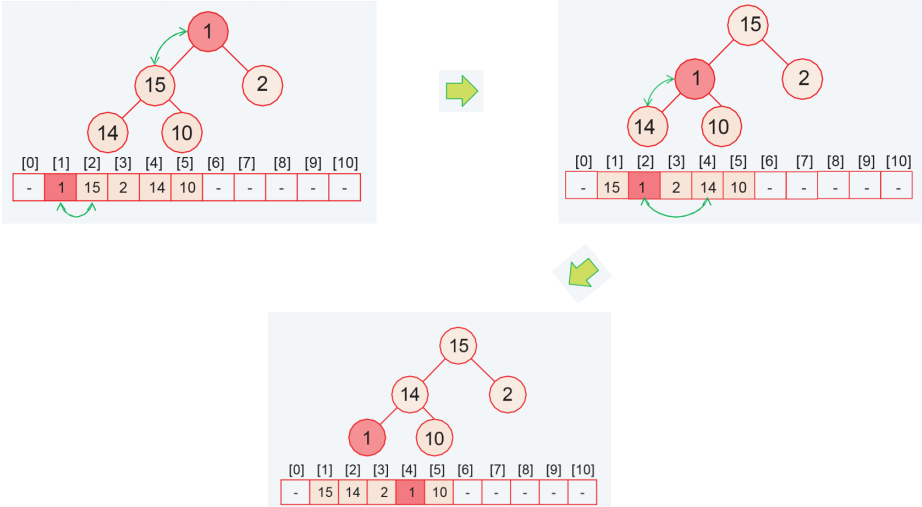

# 算法设计与分析

## 第一章 介绍 

### 1.1 框架

1.问题形式化：明确问题的输入输出

2.设计算法

3.分析

 1） 正确性证明

 2）复杂度分析

 （1） 时间复杂度分析

 （2） 空间复杂度分析


## 第二章 分治算法

本章主要介绍两个经典的分治问题---归并排序和最大子数组问题

### 1.1 归并排序 Merge Sort

**问题形式化**

输入：一个含有n个数字的序列(a1,a2,...,an)

输出：一个排列(a1',a2',...,an'),满足$a_1'<=a_2'<=...<=a_n'$

**算法设计**

将原问题分解成若干个规模较小的子问题，解决子问题后将子问题的解合并为原问题的解


**伪代码与时间复杂度分析**


### 1.2 最大子数组问题 Maximum-Subarray Problem

**问题形式化**

输入：一个有n个数的数组

输出：

(1)索引i和j使得A[i...j]具有A的任何非空连续子数组的最大和

(2)A[i...j]的和

**算法设计**

**暴力枚举**


**分而治之**

分解：将数组A划分为两个尽可能相等的子数组A[low…mid]和A[mid+1…high]，其中mid是数组中间的索引。

递归求解子问题：找出A[low…mid]和A[mid+1…high]中的最大子数组，这可以通过递归调用分治法的函数来实现。

合并：找出跨越中点的最大子数组，即将A[low…mid]中从mid向左扩展的最大子数组和A[mid+1…high]中从mid+1向右扩展的最大子数组合并。

返回：返回这三个子数组中和最大的那个。


**时间复杂度分析**

我们可以以O(n)的时间复杂度找到一个穿过中点的最大子数组

时间复杂度为O(nlogn)


**另一种更优的分治算法**

修改 FIND-MAXIMUM-SUBARRAY 使其返回四个和：最大前缀和，最大后缀和，最大子数组和，区间总和


**伪代码**

```
FIND-MAXIMUM-SUBARRAY-FAST-D&C(A,l,r)
if l>r then
	return (0,0,0,0)
else if l==r then
	return(A[r],A[r],A[r],A[r])
else
	mid=(l+r)/2
	(m1,p1,s1,t1)=FIND-MAXIMUM-SUBARRAY-FAST-D&C(A,l,mid);
	(m2,p2,s2,t2)=FIND-MAXIMUM-SUBARRAY-FAST-D&C(A,mid+1,r)
max-subarray-sum=max(s1+p2,m1,m2)
prefix=max(p1,t1+p2);
suffix=max(s2,t2+s1);
total-sum=t1+t2;
return (max-subarray-sum,prefix,suffix,total-sum)
end if
```

时间复杂度为O(n)

## 第五章 贪心算法 Greedy Algorithms

### 5.1 概述

本章学习贪心算法的基本思想。

几个经典的贪心算法：Dijkstra算法、Kruskal算法、Prim算法

涉及到的基本数据结构：堆、并查集


### 5.2 堆

#### 5.2.1 堆的概念与性质

堆是一种特殊的完全二叉树，它满足以下性质：

- 堆的所有父节点的值都必须大于或等于其子节点的值
- 给定位置为i的结点，其家族结点的位置分别为: leftChild(i)=2i,rightChild(i)=2i+1,parent(i)=$\lfloor i/2 \rfloor$

- 结点个数为n的堆的高度 $h=\lfloor log(n) \rfloor$

#### 5.2.2 两个辅助操作

1. **移上(sift-up)**

(1)图示


(2)代码实现

```cpp
void siftUp(int *Heap,int index)
{
    int heapLength=heap[0];
    if(index<1||index>heapLenth) return;
    bool done=false;
    while(!done&&index>1)
    {
        if(heap[index]>heap[index/2])
        {
        int temp =heap[index];
        heap[index]=heap[index/2];
        heap[index/2]=temp;
        }
        else
        {
            done=true;
        }
        index/=2;
    }
}
```

(3)时间复杂度 $\Theta (log n)$

2. `移下 (sift-down)`

(1) 图示



(2)代码实现

```cpp
void shftdown(int *heap,int index)
{
    int heapLength=heap[0];
    if(index<1||index*2>heapLength)
        return;
   bool done=false;
    while(!done&&index*2<=heapLength)
    {
        index*=2;
        if(index+1<=heapLength&&heap[index+1]>heap[index])
            index+=1;
        if(heap[index]>heap[index/2])
        {
            int temp=heap[index];
            heap[index]=heap[index/2]
                heap[index/2]=temp;
        }
        else 
        {
            done=true;
        }
    }
}
```

(3) 时间复杂度 $\Theta(logn)$


#### 5.2.3 基于两个辅助操作的其他操作

1. 插入

将欲插入节点放在完全二叉树最后，使用sift-up操作将其一道合适位置,时间复杂度$O(log\ n)$

2. 删除

用完全二叉树最后一个节点的值替换欲删除节点的值，并删除最后一个节点。

若欲删除节点本身为最后一个节点，停止操作并退出。不然，比较欲删除节点前后两个值的大小，若新值大于等于旧值，执行sift-up操作，否则执行sift-down操作

时间复杂度$O(log\space n)$

3.建堆

对所有子节点执行sift-down操作

时间复杂度O(n)


### 5.3 贪心算法

#### 5.3.1 算法思想

贪心算法通常被设计用于解决数量最小化或最大化的优化问题。它通常由一个试图找到局部最优解的迭代过程组成。贪心算法一步一步地构建解决方案，而不考虑未来。贪心算法基于局部优化地每一步都增加局部解的大小

贪心算法容易创造，但不一定能给出最优的解决方案

设计贪心算法的困难之处在于证明该算法确实解决了它所涉及的问题


#### 5.3.2 区间调度问题(Interval sheduling)

1. 问题描述：

有n项工作，每项工作分别在$s_i$开始，在$t_i$结束。如果两项工作的时间段不重叠，那么他们就是兼容的。我们的目标是在所有工作中找出相互兼容的工作的最大子集


2. 贪心策略：选择结束时间最早的工作

3. **伪代码:**


4. 时间复杂度:O(nlogn)

5. 算法正确性证明

假设该算法不能得到最优解

设i1,...,ik代表通过贪心算法选择的工作集合，j1,...,jm代表最优解选择的工作集合

m>k且存在一个最大的可能值使得i1=j1,...,ir=jr

由于m>k,那么工作jr+1存在，根据贪心策略，工作jr+1存在并且结束时间不晚于jr+1

不妨用ir+1替换jr+1，容易发现替换后仍是最优解，与只有前r个相同不符，所以假设不成立

所以该算法得到的是最优解


### 5.4 Dijkstra 算法

**5.4.1** **问题描述**

给定有向图G=(V,E)，每条边的权le都是**非负实数**。指定V中一个顶点s为源。计算源到所有其他各顶点的

最短路径。这称为单源最短路径问题。

**5.4.2** **算法思想**

1.算法分类：贪心算法

2.数据结构：

集合S：V中已经确定了到源点最短路径的顶点。

d[v]：从s到v的最短路径长度。

α[v]：从s到v最短路径长度的估计值。
$$
\alpha [v]=min_{e=(u,v):u\in S}(d[u]+l_e)
$$
pred[v]：记录v的前驱。

3.算法步骤：

（1）初始化：对所有v!=s,α[v]=∞，pred[v]=null,S=$\empty$,a[s]=0;

（2）从u$\notin$S中选择一个具有最小α[u]值的顶点u，并加入到集合S中；

（3）对于所有从u离开的边e=(u,v)，如果a[v]>a[u]+le，则a[v]=a[u]+le，且pred[v]=e；

（4）重新回到第二步，如此重复，直到S包含G中所有顶点。

#### 5.4.3 伪代码


使用有限队列可以更高效地找到更小的α

2. 时间复杂度 O(mlogn)

初始化 O(n) 

建立优先队列插入V中顶点O(n) 

while循环 O(nlogn)+$\sum|adj[u]|O(log n)=O(mlogn)$

#### 5.4.4 算法证明

欲证明的结论：对于所有属于S的顶点u，d[u]是s到u的最短路径长度

使用数学归纳法证明：

1. 对于|S|=1时，S={s}，d[s]=0，s到s的最短路径为0，结论显然成立
2. 假设|S|=K时,对于S中的所有顶点，d[u]都是s到u的最短路径长度
3. 当|S|=K+1时，假设新加入的顶点为顶点v,顶点e为顶点v的前驱节点

假设通过贪心规则找到的到达v的路径不是最短路径，则存在一个顶点$X\notin S$为v的全区节点，此时到达v的路径长度为$d[x]+l_{xv}$

但是根据贪心规则有
$$
d[v]<=d[x]
$$
由于边的长度非负，有
$$
d[v]<d[x]+l_{xv}
$$
所以通过贪心规则选择的路径为到达v的最短路径

证毕

#### 5.4.5 BFS和Dijkstra算法的关系

BFS和Dijkstra算法很相近，都能计算最短路，但是BFS只能求每条边权值都相等的图(或无权值图)的最短路


### 5.5 最小生成树

#### **5.5.1** 生成树

1.定义：若H=(V,T)是**无向图**G=(V,E)的子图并且H是**连通无圈**的，那么H是G的生成树。

2.性质:

下列性质是等价的：

（1）H是G的生成树

（2）H是无圈的连通图

（3）H是连通图并且有|V-1|条边

（4）H是无圈图并且有|V-1|条边

（5）从H中删去任意一条边都会使H不连通

（6）在H中添加任意一条边都会使有圈

3.最小生成树问题：寻找总权值最小的生成树

#### 5.5.2 Kruskal

算法分类：贪心算法

算法步骤:

1. 初始化：用集合T代表最小生成树的边集合，初始时为空集
2. 对所有边的权值从小到大排序
3. 按排序好的顺序选择一条边e，如果在集合T中添加这条边不会产生圈，那么就把e添加到T中
4. 重复第三步，直到T中有n-1条边


这里使用了并查集

时间复杂度O(mlogm)

#### 5.5.3 Prim算法

算法步骤：

1. 将点s设为源点，s可以是图中任意一个顶点，T为空集
2. 找出有且仅有一个端点在T中的边，选择其中权值最小的边并加入到T中
3. 重复第三步，直到T中有n-1条边

伪代码：


4. 时间复杂度：O(mlog n)

#### 5.5.4 算法正确性证明

##### Kruskal算法

假设根据Kruskal算法得到的树为G，假设令T为一颗最小生成树

若G=T，则算法正确性得证。

若G不等于T，则G中至少有一条最小权值边在G中而不在T中，设该边为e，把e加入T中，此时形成环，再删掉环中不在G中的边f，得到新树T'

若w(f)>w(e),则T‘的权值小于T的权值，这与T是最小生成树矛盾

若W(f)<w(e)，说明Kruskal算法再考虑加入e之前考虑过边f，之所以没加入f是因为f和之前加入的边形成环，之前加入的边权值显然不超过w(f)，所以之前加入的边权值一定小于w(e)。而根据e的定义，G中权值小于w(e)的边都在T中，这说明T中的边会与f构成环，这与T是最小生成树矛盾

所以w(f)=w(e),T’仍然是最小生成树，而T与G中不同的边权值都相同，G也是最小生成树，原问题得证

**最优子结构**

不失一般性，设由Kruskal算法得到的最小生成树为G，其中权值最小的边为e，要证明最优子结构，此时需合并以e为边的两个节点a,b为一个整体节点c,并删除边e，此时得到的新生成树记作G'，若G'是最小生成树，原问题正确性得证；若G'不是最小生成树，则存在另一最小生成树G''，且，将G''的c节点重新扩展为以e为边的两个节点a,b得到最小生成树G''',此时

$$
w(G''')=w(G'')+w(a)+w(b)<w(G'')+w(a)+w(b)=w(G)
$$
但G是最小生成树，所以该公式矛盾，依次类推得证Kruskal算法正确性。

##### Prim算法

**贪心选择**

不失一般性，令起始节点为a，与a相连且度最小的另一节点为b，该边记作y，现证明y包括在某最优解中。令G为一颗最小生成树，

若其中包括y，算法正确性得证成立；若不包括y，则将y加入到G中，此时形成环，不考虑环以外节点，删除与a相邻另一条边c，删除后得新生成树G’,而，所以G'也一定为一颗最小生成树，算法正确性得证。
**最优子结构**

不失一般性，设由Prim算法得到的最小生成树为G，其中度最小的两个相邻顶点为a,b,要证明最优子结构，此时需合并a,b为一个整体节点c，并删除连接a,b的边y，此时得到的新生成树记作G’，若G‘是最小生成树，则原问题得证；若G’不是最小生成树，则有另一最小生成树G‘‘，且w(G‘‘)<w(G‘)，将G‘‘的c节点重新扩展为a,b得到最小生成树G‘‘‘，此时
$$
w(G''')=w(G'')+w(a)+w(b)<w(G'')+w(a)+w(b)=w(G)
$$
这与G是最小生成树矛盾，所以该公式矛盾

#### 5.5.5 并查集

**基本概念：**

（1）并查集用于处理一些不相交集合的合并及查询问题，通常用树来表示，将每个集合表示成一棵树。

（2）每个树中的元素都有指向其父节点的指针。

（3）用每棵树的根作为代表元，根的指针指向其自身。

**基本操作：**

（1）初始化（MAKE-SET(x)）：x所在集合初始化为其自身。

（2）查找（FIND(x)）：查找x所在树的根。

（3）合并（UNION(x,y)）：合并x，y所在的两棵树

**实现方式：**

1. **native linking**

合并时将第一棵树的根直接与第二课树的根连接

最坏情况下一个FIND操作可能需要$\Theta(n)$的时间，需要改进

2. **link-by-rank**

给每个点都设置一个整数rank值，初始时为0。合并时将具有较小rank值的根连到具有较大rank值的根；如果两个根rank值相同，将新根的rank值加1


**性质：**

①如果x不是根，那么rank[x]永远不会变。

②如果x不是根，那么rank[x]< rank[parent[x]]。

③如果parent[x]变了，那么rank[parent[x]]严格增加。（如果parent[x]变了那么x一定是根，当x通过link-by-rank连接到一个新根r后，rank[parent[x]]=rank[r]>rank[x]）

④rank值为k的任意节点都至少有2 k个节点在其子树中

⑤一个节点可能的最大rank值是 $\lfloor log n\rfloor$

⑥rank值为k的节点个数最多有 $\frac{n}{2^k}$

最坏情况下，UNION和FIND操作都只需要O(log n)的时间

3. **path compression**

当找到包含x的树的根r时，将从x到r的路径上所有节点的父指针指向r(带路径压缩的FIND操作引起树结构改变)


路径压缩会使树结构改变，但不改变节点的rank值，所以height[x]<=rank[x]。

4. **link-by-rank with path compression**

由于路径压缩不改变树根、节点的rank和树中的元素，所以性质和link-by-rank中的六条性质基本一样，除了第4条性质中不再是所有节点满足，而是只有根节点才满足。

再看Kruskal算法的时间复杂度：

（1）对边的权值排序：O(mlogm)

（2）初始化：O(n)

（3）for循环： O(m)FIND=(m+n)log*n


## 第八章 NP完全性 NP-Completeness

### 8.1 问题及其复杂性

**问题和实例**

问题：输出和输入部分

实例：一个特定的输入

**问题的复杂性**

解决问题所需要的计算量的大小，是问题的内在属性，这里的问题指的并非是单一问题，而是某类问题

**算法的复杂性**

算法的运行时间和控件随着问题规模如何变化

### 8.2 问题的两种形式

**判别形式（decision problem）和优化形式（optimization problem）**

问题的判别形式只需回答yes或no，优化形式输出问题的最优结果

判别形式的输出比较简单，利于我们进行复杂度分析


**两种问题形式的关系**

一个优化形式的问题可以通过施加结果值的界限来转化为判别形式的问题

判别形式的问题可以通过二分搜索去得到优化形式的解

其中一个形式的问题可以解决，另一个形式的问题也能解决

判定形式和优化形式在本质上差别很小，后面我们统一使用问题的判别形式


### 8.3 归约 Reduction

#### 8.3.1 多项式时间归约

一个可以在满足下列条件下能够将任意问题A的实例转化为一个问题B的实例的程序

条件：

- 转化：转化过程使用多项式时间完成
- 等价：两个实例的答案相同

记作$A\ \le_P\ B$ 读作A可规约为B

#### 8.3.2 定理

**定理1**

如果问题B在多项式时间内可解，那么问题A在多项式时间内也可解

```
证明：
我们可以通过以下步骤解决问题A的一个实例α
1. 将α在多项式时间内规约为问题B的一个实例β
2.对β执行问题B的多项式时间算法
3.使用实例β的答案作为实例α的答案
由步骤可以看出，问题A也是多项式时间可解的
```

**定理2**

如果A是困难的，B也是困难的

困难：问题不存在多项式时间算法

```
证明：
使用反证法，假设B问题可以在多项式时间内解决
那么通过定理1证明的步骤可知，问题A也可以在多项式时间内解决
这与假设矛盾
所以B也是困难的
```

### 8.4 顶点覆盖问题到集合覆盖问题的规约

#### 8.4.1 顶点覆盖问题

输入：一个无向图G=<V,E>和一个整数k

输出：是否存在顶点集合S，含有k个顶点，使得任何图G一条边都和S里面的顶点相关联。如果存在回答YES，否则回答NO

#### 8.4.2 集合覆盖问题

输入：n个元素的集合U，一个集合S包含U的m个子集，以及一个整数k

输出：能不能从集合S中选出不超过k个子集，使得选中的子集的并集包含U中的所有元素

#### 8.4.3 规约过程

1. 给出顶点覆盖问题的一个实例G=<V,E>和k
2. 让U=E，并且对于V中的每个顶点，该顶点关联的边构成一个集合作为S的一个元素
3. 通过步骤2，我们就构建了集合覆盖的实例(U,S,k)

#### 8.4.4 规约的正确性证明

充分性：令顶点集X是顶点数为k的V的子集，能找到大小为k的集合Y，包含了X里面所有顶点对应的集合覆盖问题的子集元素。即当集合覆盖问题回答与顶点覆盖问题回答相同

必要性：令集合Y是集合数位k的S的子集，能找到大小为k的顶点集X。所以顶点覆盖问题回答与集合覆盖问题回答相同


### 8.5 3SAT问题到团问题的规约

#### 8.5.1 3-CNF-SAT Problem

CNF：conjunctive normal form 合取范式

SAT：satisfiability 满足性 

输入：一个合取范式 包含k个子句，每个子句含有三个文字

输出：合取范式是否可以满足

#### 8.5.2 Clique Problem

输入：一个无向图G=<V,E>和一个整数k

输出：是否存在一个顶点集V的含有k个顶点的子集V\`使得V \` 中的任意两个顶点都由一条边所连接


#### 8.5.3 归约

**定理**
$$
3SAT\le_PClique
$$
证明：

给出一个3SAT问题的实例$\Phi$，我们通过以下步骤构建一个团问题的实例<G,k>有一个大小为k的团当且仅当3SAT问题的实例可以满足

1. G为每个子句创建顶点，一个顶点代表一个文字
2. 如果两个顶点属于不同的子句，并且它们不是彼此的否定，那么连接这两个顶点


$\Phi$是可满足的，当且仅当有大小为k的团

**证明：**

充分性：对于$\Phi$的任意一组满足的指派，选择出对应的顶点，这些顶点可以构成一个大小为k的团

必要性：让V`为大小为k的团的顶点集，将对应的文字设置为true，$\Phi$就可以满足


### 8.6 Clique问题到顶点覆盖问题的归约

#### 8.6.1 顶点覆盖问题

输入：一个图G=<V,E>和一个整数k

输出：一个顶点集V的子集S，使得G中的每条边都与S中的顶点相关联

#### 8.6.2 归约

**定理**
$$
Clique\le_P\ VertexCover
$$
给出一个团问题的实例<G=(V,E),k>，我们可以构造一个顶点覆盖实例<G补=(V,E补),k'>

G有一个大小为k的团当且仅当G补有一个大小为k’=|V|-k的顶点覆盖


充分性：

V‘为V中大小为k的团的顶点集合

让(u,v)为E补中的任意一条边，那么u或者v至少有一个属于V-V'

因此，V-V'是G补的顶点覆盖


必要性：

让V‘是G补中的顶点覆盖结果顶点集，让(u,v)为任意一条E补中的边，u和v中至少有一个顶点属于V'，因此V-V' 是G中的大小为k=|V|-|V'|的团


**归约具有传递性**


### 8.7 问题的复杂性类别

#### 8.7.1 P 类

P类问题的判别问题可以在多项式时间内解决

#### 8.7.2 NP类

可以在多项式时间内验证的问题

多项式时间内验证：给出一个实例和解，在多项式时间内验证该解是否正确


**定理**

P是NP的真子集


#### 8.7.3 NP完全问题

所有的NP类问题都可以归约到问题Y，那么这个问题就是NP-Complete问题


SAT问题是NP完全问题


**定理**

如果X是NP完全问题，Y是NP问题且$X\le_P Y$，那么Y也是NP完全问题


顶点覆盖、集合覆盖问题也是NP完全问题


#### 8.7.4 NP难问题

所有的NP-Complete问题都可以归约到问题Y，那么这个问题Y就是NP-hard问题
